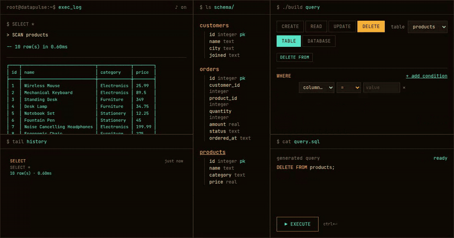
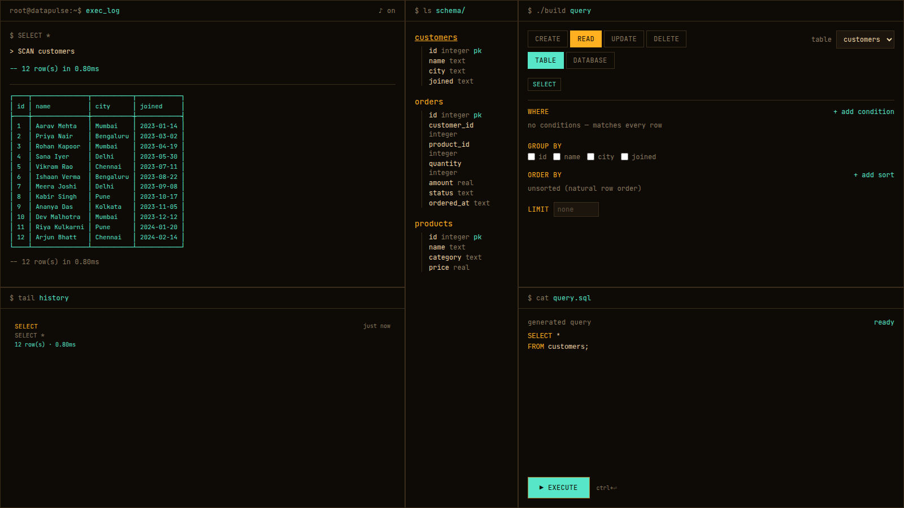
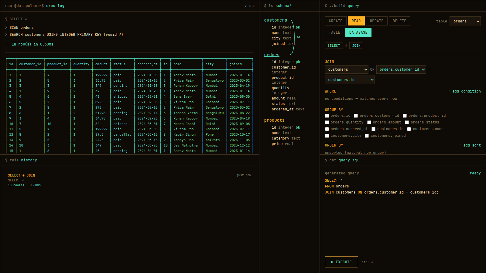
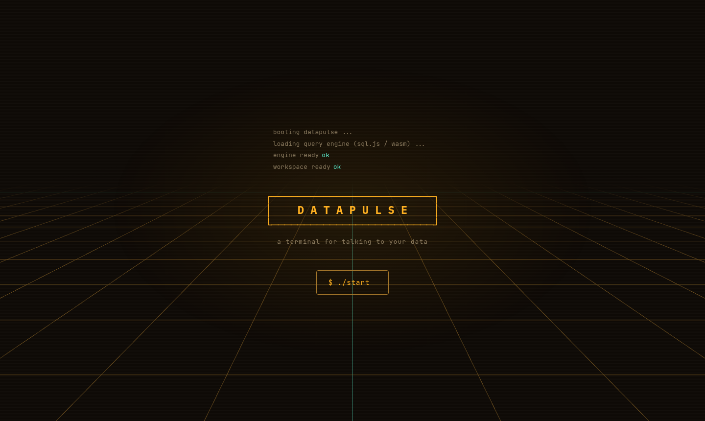

# DATAPULSE

A SQL playground where the queries actually run.

<p align="center">
  
</p>

<!-- Once it's deployed, drop the URL here:  **[Try it →](https://your-url)** -->

Build a query with the blocks on the right, hit EXECUTE, and it runs against a real SQLite database — sql.js
compiled to WebAssembly, living in your browser tab. No server, no mock data layer, no fake loading spinner.
The row counts and the millisecond timings are whatever the engine actually reported.

The database is seeded fresh on every page load and thrown away when you close the tab. That's the whole
idea. You can `DROP TABLE customers` and find out exactly what happens, then refresh and have it back.

## Watching the rows

Most SQL tools hand you a result grid and leave the rest to your imagination. Here the rows a statement
touches are the ones that move.

Delete some rows and they flash, take a strike-through, and collapse out while the survivors close up over
them. Update them and they glow amber while only the cells that genuinely changed scramble from noise into
their new values. Insert one and it drops into place. The rows you *didn't* touch stay on screen throughout,
so you can see where in the table the change actually landed.

None of it is choreography over invented data. Before the statement runs, the rows matching its `WHERE`
clause are snapshotted by `rowid`; afterwards the table is read back and the two are diffed. What animates is
what the database did.

## The workspace



Three panels. On the left, the execution trace and results. The trace is SQLite's own `EXPLAIN QUERY PLAN`
output, run as a real query, so `> SCAN customers` means it really is doing a full scan. Underneath is a
history of everything you've run this session, and clicking any entry loads it back into the builder.

In the middle, the schema, read straight out of the running database with `sqlite_master` and
`PRAGMA table_info`. It can't drift from reality because it isn't a copy of it. Add a column and it's there.
Click any table name to start querying it.

On the right, the builder. Pick a mode (CREATE / READ / UPDATE / DELETE) and a scope (TABLE / DATABASE), and
the relevant blocks appear: WHERE, JOIN, GROUP BY, ORDER BY, SET, VALUES. The SQL underneath is generated
from those blocks and the live schema, and it's the exact string that gets executed. Nothing is assembled by
hand anywhere else in the codebase.

### Joins



Switch to DATABASE scope on a READ and you can join two tables. The schema panel draws a line between them,
positioned from the measured screen coordinates of the two rows rather than guessed. The trace picks up the
second stage: `SEARCH customers USING INTEGER PRIMARY KEY`.

DATABASE scope on the other three modes is DDL — build a table from scratch, add or rename a column, or drop
a table entirely. Dropping asks for a confirmation first, which is the one place the app slows you down on
purpose.

## Running it

Node 20 or newer.

```sh
npm install
npm run dev
```

Open the URL it prints, usually `http://localhost:5173`. There's no backend to start and nothing to
configure. The sql.js WebAssembly binary is committed to the repo, so `npm install` is genuinely all of it.

```sh
npm run build     # type-check + production build into dist/
npm run preview   # serve that build locally
npm run lint      # oxlint
```

## Deploying

`npm run build` gives you a static `dist/`. Point any host at it — Vercel, Netlify, Cloudflare Pages, GitHub
Pages — with build command `npm run build` and publish directory `dist`.

Two things about hosting under a subpath (like `username.github.io/datapulse/`) are worth knowing, because
both were real bugs before they were fixed:

`vite.config.ts` sets `base: './'`. With Vite's default `base: '/'`, every script and stylesheet resolves
against the domain root instead, 404s, and you get a blank page with nothing useful in the console. Relative
URLs work from a subpath and a root domain alike, which is safe here because this is a single page with no
client-side router.

`public/sql-wasm.wasm` is fetched at runtime relative to that same base. Since that file *is* the database,
getting the path wrong doesn't degrade gracefully — the app stops dead at "failed to start query engine".
Both cases are verified against an actual subpath deployment.

## Built with

React 19, TypeScript, Vite, Tailwind v4, [sql.js](https://sql.js.org/), [Zustand](https://zustand-demo.pmnd.rs/)
for state, [GSAP](https://gsap.com/) for the choreography, [Tone.js](https://tonejs.github.io/) for the sound
effects, and [three.js](https://threejs.org/) for the grid on the landing screen. Tone and three are both
behind dynamic imports so they stay out of the initial bundle.

Fonts are self-hosted deliberately. The tables and the wordmark are drawn out of box-drawing characters
(`─ │ ┌ ┬`), and the subsets Google Fonts serves don't include that Unicode block, so those glyphs used to
fall back to a system font at a different width and the table borders drifted out of line with their own
columns.

```
src/
  lib/
    db/          sql.js loading, seed data, schema introspection, EXPLAIN QUERY PLAN parsing, row snapshots
    query/       SQL generation from builder state + live schema
    ascii/       the box-drawing table and wordmark renderers
    animation/   the scramble-text tween
    sound/       Tone.js synths behind a dynamic import, plus the mute toggle
  state/         one Zustand store: engine + builder
  components/    landing/, transition/, workspace/
```

<p align="center">
  
</p>
